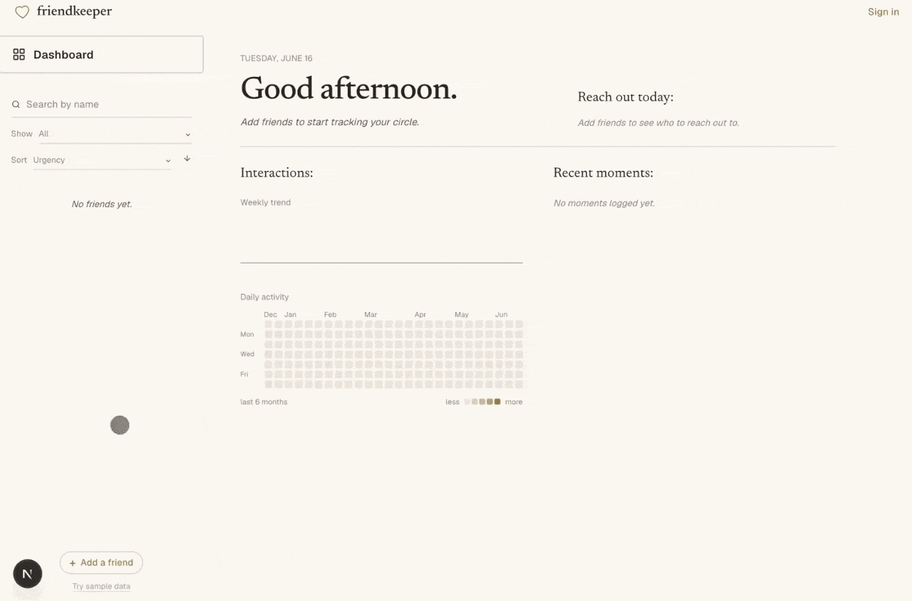

# friendkeeper

A web app to help you stay in touch with the people you care about. Track conversations, log hangouts, and get AI-powered nudges on who to reach out to next.

Live: https://friendkeeper.vercel.app

---



---

## Features

- log texts and hangouts with each friend
- track how long since last interactionand how often you want to stay in touch
- notes on what you talked about, mood, and topics per interaction
- ai conversation starters based on your interaction history
- monthly ai report based on who you've been close to and who's drifting
- interaction heatmap, streaks, and friendship health scores
- guest mode, no account needed!

## Stack

Next.js, TypeScript, Tailwind CSS, Neon PostgreSQL, Clerk, Groq (Llama 3.1), Recharts. Deployed on Vercel.

## Getting started

```bash
git clone https://github.com/yourusername/friendkeeper
cd friendkeeper
npm install
cp .env.example .env.local
npm run dev
```

Fill in your keys in `.env.local`, then open http://localhost:3000. Guest mode works without a database.

## Environment variables

| Variable | Description |
|---|---|
| `DATABASE_URL` | Neon PostgreSQL connection string |
| `GROQ_API_KEY` | Groq API key for AI features |
| `NEXT_PUBLIC_CLERK_PUBLISHABLE_KEY` | Clerk publishable key |
| `CLERK_SECRET_KEY` | Clerk secret key |
| `NEXT_PUBLIC_CLERK_SIGN_IN_URL` | Sign-in page path |
| `NEXT_PUBLIC_CLERK_SIGN_UP_URL` | Sign-up page path |
| `NEXT_PUBLIC_CLERK_AFTER_SIGN_IN_URL` | Redirect after sign-in |
| `NEXT_PUBLIC_CLERK_AFTER_SIGN_UP_URL` | Redirect after sign-up |
| `NEXT_PUBLIC_CLERK_AFTER_SIGN_OUT_URL` | Redirect after sign-out |

## License

MIT
